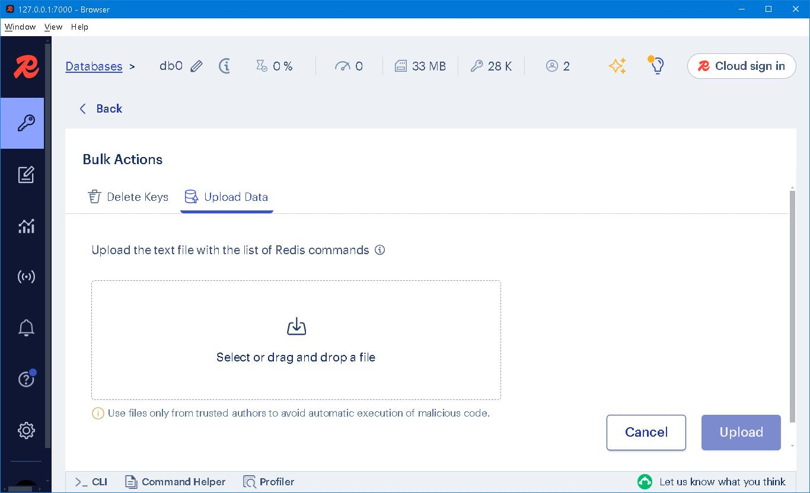

### Dong Dict 


### Prologue
In the year of 2011, I began to read the chinese historical novel **Dong Zhou Lie Guo Zhi** ([東周列國志](http://www.open-lit.com/book.php?bid=20)). On 2013/05/13, I finished the first read and on 2017/10/13 the second read. During the passed years, numerous characters, events, locations and terms were jotted down, ie. hundreds and thousands of entries in a text file of 23.0 MB (24,199,940 bytes). 


### I. The manuscript 
Each entry starts with a **pipe** character "|" which immediately followed by description on the next line, ie: 
```
|word
Lorem ipsum dolor sit amet consectetur adipisicing elit. Quos animi obcaecati, 
placeat perspiciatis illo, incidunt autem recusandae repudiandae cum doloremque, 
pariatur iusto? Dolorum fugit quas nobis maxime, magnam beatae ex?
```

The following indicates a **synonym group**:
```
|wordA
|wordB
|wordC
Lorem ipsum dolor sit amet consectetur adipisicing elit. Quos animi obcaecati, 
placeat perspiciatis illo, incidunt autem recusandae repudiandae cum doloremque, 
pariatur iusto? Dolorum fugit quas nobis maxime, magnam beatae ex?
```

wordA, wordB and wordC shares the same description. There was no way to prevent from inputting duplicated entries. 


### II. An early attempt
In the year of 2012, I was thinking to make a web site to enable the dictionary look up . My idea was to statically generate an `index.html` and as many html pages as number of entries. All files were hosted in a static web site. Regular re-generation was required to update the web stie. 


For reason of so and so, this idea was suspended; for reason of such and such, this idea was soon abandoned. 

### III. On second thought
The simplest approach to implement a dictionary is create a table using RDBMS: 
```
CREATE TABLE dictionary (
    word VARCHAR(80) PRIMARY KEY,
    description TEXT NOT NULL
);
```

Duplicated words are rejected as it violates primary key constraint. However, there are two ways to handle duplicated entries: 
1. Keep the first description by ignoring the last; 
2. Keep the last description by overwriting the first; 

Some RDBMS has [UPSERT](https://www.cockroachlabs.com/blog/sql-upsert/) command while others provides `INSERT … ON DUPLICATE KEY UPDATE` or similar construct so that it's *not* necessary to check existence first. 

To keep the first, we do this in MySQL 8: 
```
INSERT INTO dictionary (word, description)
VALUES ("word", 'Lorem ipsum dolor sit amet consectetur adipisicing elit.')
ON DUPLICATE KEY UPDATE word = word;
```

To keep the last, we do this in MySQL 8: 
```
INSERT INTO dictionary (word, description)
VALUES ('word', 'Lorem ipsum dolor sit amet consectetur adipisicing elit.')
ON DUPLICATE KEY UPDATE description = VALUES(description)
```

As for **synonym group**, the idea is to split them into independent entries and each with identical description. 


### IV. From then to now...
Redis Hash is my favourite data structure, a comfort zone for RDBMS immigrants. 

To keep the last, we do this in Redis: 
```
HSET "word" description "Lorem ipsum dolor sit amet consectetur adipisicing elit."
```

[HSET](https://redis.io/docs/latest/commands/hset/) sets the specified fields to their respective values in the hash stored at key. To keep the first, we do this in Redis: 
```
HSETNX "word" description "Lorem ipsum dolor sit amet consectetur adipisicing elit."
```

[HSETNX](https://redis.io/docs/latest/commands/hsetnx/) sets field in the hash stored at key to value, only if field does not yet exist. If key does not exist, a new key holding a hash is created. If field already exists, this operation has no effect.

Both `HSET` and `HSETNX` are O(1) for each field/value pair added which are ideal for fast data ingestion.  


### V. Data conversion
1. Convert text file into json format; 
2. Convert json data into redis `HSET` command; 
3. Use [Redis Insight](https://redis.io/insight/) `Bulk Actions` to upload; 




### VI. Who wrote this app? 
Dreams which I have yearned so long suddenly becomes palpable. 


### VII. Bibliography
1. [東周列國志](http://www.open-lit.com/book.php?bid=20)
2. [Upsert in SQL: What is an upsert, and when should you use one?](https://www.cockroachlabs.com/blog/sql-upsert/)
2. [The Adolescent by Fyodor Dostoevsky](https://www.holybooks.com/wp-content/uploads/The-Adolescent-by-Fyodor-Dostoevsky.pdf)


### Epilogue 


### EOF (2024/10/18)
