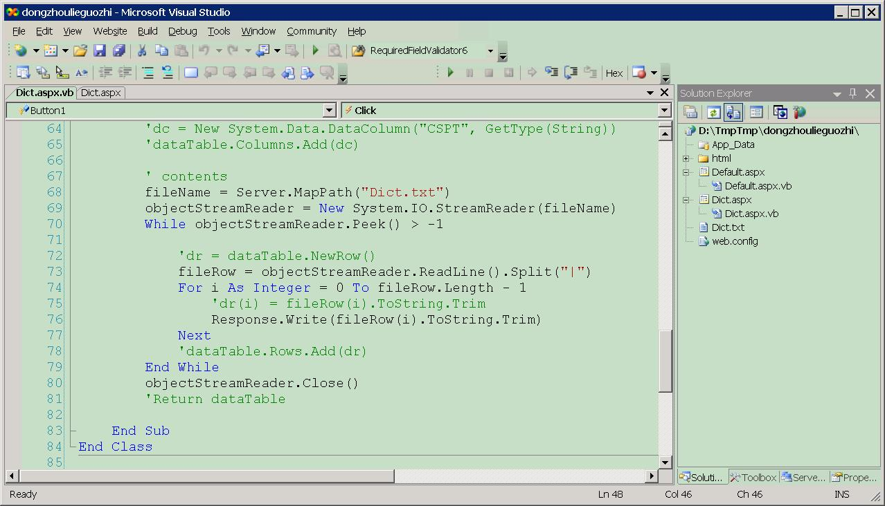
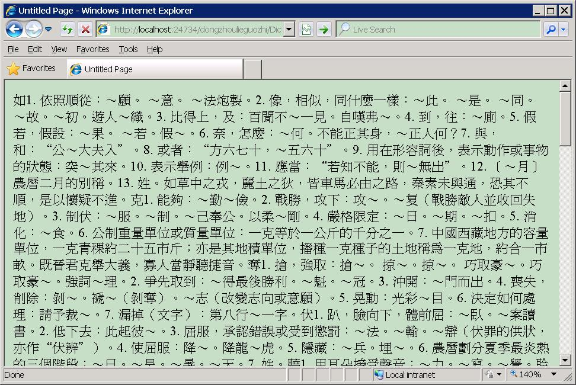
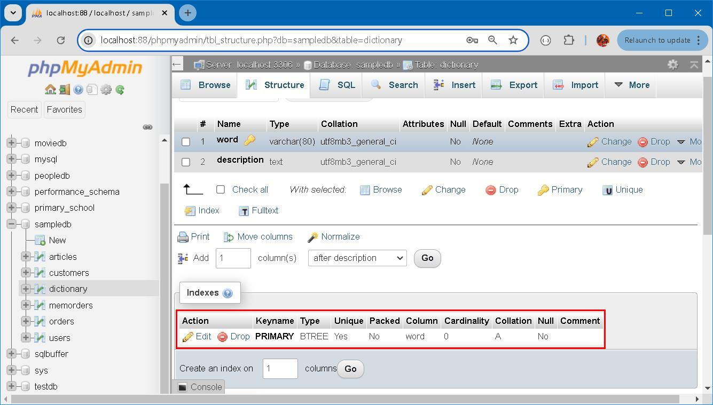

### Dong Dict 


### Prologue
In the year of 2011, for some *untold* reason I began with the voluminous chinese historical novel **Dong Zhou Lie Guo Zhi** ([東周列國志](http://www.open-lit.com/book.php?bid=20)). On 2013/05/13, I managed to finish the first read and on 2017/10/13 I was utterly fatigued in the second read. During the passed years, numerous protagonists, supporting characters, events, geographical locations and various kinds of terms were jotted down in hundreds and thousands of entries in a text file of 23.0 MB (24,199,940 bytes) in size. 


### I. The manuscript 
To begin with, I have to explain the format of this manuscript. Each entry starts with a **pipe** character "|" which immediately followed by description on the next line, ie: 
```
|word
Lorem ipsum dolor sit amet consectetur adipisicing elit. Quos animi obcaecati, 
placeat perspiciatis illo, incidunt autem recusandae repudiandae cum doloremque, 
pariatur iusto? Dolorum fugit quas nobis maxime, magnam beatae ex?
```

The following indicates a **synonym group**:
```
|wordA
|wordB
|wordC
Lorem ipsum dolor sit amet consectetur adipisicing elit. Quos animi obcaecati, 
placeat perspiciatis illo, incidunt autem recusandae repudiandae cum doloremque, 
pariatur iusto? Dolorum fugit quas nobis maxime, magnam beatae ex?
```

wordA, wordB and wordC share the same description. Due to the nature of text file, for sure there are duplicated entries. 


### II. An early attempt
In the year of 2012, I was thinking to make a web site to enable fast look up. My preliminary idea was to generate as many .html pages as the number of entries statically. Supplementing an `index.html` which served as the entry point and linked together all other .html files. A regular re-generation was required to update the web site. I was quite readily to host the web site on my [Windows XP](https://en.wikipedia.org/wiki/Windows_XP). At that time, hosting an publicly accessable website was an expensive activity and let alone the database. 





For reason of so and so, this idea was suspended; for reason of such and such, this idea was soon dissipated but never been abandoned... 


### III. On second thought
The simplest approach to implement a dictionary is to create a table in RDBMS: 
```
CREATE TABLE dictionary (
    word VARCHAR(80) PRIMARY KEY,
    description TEXT NOT NULL
);
```

Duplicated words are rejected as it violates primary key constraint. However, there are two ways to handle duplicated entries: 
1. Keep the first description by ignoring the last; 
2. Keep the last description by overwriting the first; 

Some RDBMS has [UPSERT](https://www.cockroachlabs.com/blog/sql-upsert/) command while others provides `INSERT … ON DUPLICATE KEY UPDATE` or similar language construct so that it's *not* necessary to check existence first. 

To keep the first, we do this in MySQL 8: 
```
INSERT INTO dictionary (word, description)
VALUES ("word", 'Lorem ipsum dolor sit amet consectetur adipisicing elit.')
ON DUPLICATE KEY UPDATE word = word;
```

To keep the last, we do this in MySQL 8: 
```
INSERT INTO dictionary (word, description)
VALUES ('word', 'Lorem ipsum dolor sit amet consectetur adipisicing elit.')
ON DUPLICATE KEY UPDATE description = VALUES(description)
```

Furthermore, Use this for prefix search: 
```
SELECT word FROM dictionary WHERE word LIKE 'app%' 
```

RDBMS organizes index in [B-tree](https://en.wikipedia.org/wiki/B-tree). Traversing index tree and scanning the key for a given pattern is a time-consuming process. 



```
SELECT description FROM dictionary WHERE word = 'apple' 
```
Time complexity is O(ln N), where O(ln 28792)≈14.81, which means at most 15 checks are done before the word is met or else not found. Note that this is only the physical location, subsequent disk I/O has to be performed to retrieve the description and return accordingly. 

We didn't tackle the **synonym group** yet but the idea is to split them into independent entries and each with identical description. 


### IV. From then to now...
In the year of 2024, I came across Redis. I was dumbfounded at how it work and operate. Being my favourite data structure, [Hashes](https://redis.io/docs/latest/develop/data-types/hashes/) is comfort zone for RDBMS immigrants. It is super super fast and super easy to use. The downside of it is that all values are stored as string and can not have nested structure. 

To cope with duplicated entries. Use this to keep the last: 
```
HSET "word" description "Lorem ipsum dolor sit amet consectetur adipisicing elit."
```

[HSET](https://redis.io/docs/latest/commands/hset/) sets the specified fields to their respective values in the hash stored at key. Use this to keep the first: 
```
HSETNX "word" description "Lorem ipsum dolor sit amet consectetur adipisicing elit."
```

[HSETNX](https://redis.io/docs/latest/commands/hsetnx/) sets field in the hash stored at key to value, only if field does not yet exist. If key does not exist, a new key holding a hash is created. If field already exists, this operation has no effect.

Both `HSET` and `HSETNX` are O(1) for each field/value pair added which are ideal for *fast data ingestion*. Hash is good for exact match and bad for range query: 

Use this for prefix search: 
```
SCAN 0 MATCH "app*" COUNT 1000
```
Time complexity is O(1) for every call. O(N) for a complete iteration, including enough command calls for the cursor to return back to 0. N is the number of elements inside the collection.

```
HGETALL "apple"
```
Time complexity is O(N) where N is the size of the hash.


### V. Who the dickens wrote the code? 
Hooray! Long yearned dreams suddenly becaomes palpable... 

1. Convert the manuscript into json format; 
2. Convert json data into Redis `HSET` command and handle synonym issue; 
3. Use [Redis Insight](https://redis.io/insight/) `Bulk Actions` to upload data; 
4. Write NodeJS app featuring [Express](https://expressjs.com/), [EJS](https://ejs.co/), [Tailwindcss](https://tailwindcss.com/) and Redis as backend database;. 


[Click to open](https://dongdict.onrender.com/)


### VI. Bibliography
1. [東周列國志](http://www.open-lit.com/book.php?bid=20)
2. [中國哲學書電子化計劃](https://ctext.org/zh)
3. [粵語審音配詞字庫](https://humanum.arts.cuhk.edu.hk/Lexis/lexi-can/)
4. [漢典](https://www.zdic.net/)
5. [Upsert in SQL: What is an upsert, and when should you use one?](https://www.cockroachlabs.com/blog/sql-upsert/)
6. [The Adolescent by Fyodor Dostoevsky](https://www.holybooks.com/wp-content/uploads/The-Adolescent-by-Fyodor-Dostoevsky.pdf)


### Epilogue 
> 顧人多不能讀史，而無人不能讀稗官。稗官固亦史之支派，特更演繹其詞耳。善讀稗官者，亦可進於讀史，故古人不廢《東周列國》一書，稗官之近正者也。周自平轍東移，下逮呂政，上下五百有餘年之間，列國數十，變故萬端，事緒紛糾，人物龐雜，最為棘目聱牙，其難讀更倍於他史。而一變為稗官，則童穉無不可得讀。夫至童穉皆可讀史，豈非大樂極快之事邪？然世之讀稗官者甚眾，而卒不獲讀史之益者何哉？蓋稗官不過紀事而已，其有智愚忠佞賢奸之行事，與國家之興廢存亡盛衰成敗，雖皆臚列其跡，而與天道之感召，人事之報施，智愚忠佞賢奸計言行事之得失，及其所以盛衰成敗廢興存亡之故，固皆未能有所發明，則讀者於事之初終原委，方且懵焉昧之，又安望其有益於學問之數哉？夫既無與於學問之數，則讀猶不讀，是為無益之書，安用災梨禍棗為？坊友周君，深慮於此，囑予者屢矣。


### EOF (2024/10/18)
